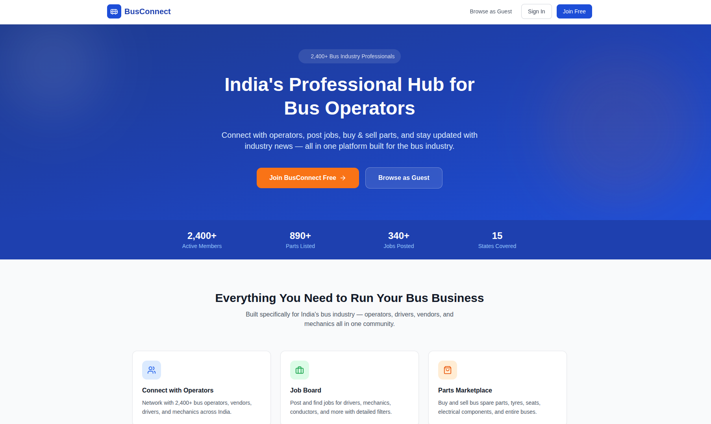

# BusConnect

India's Professional Hub for Bus Operators — a LinkedIn-style social platform built for the bus industry. Connect with operators, drivers, vendors, and mechanics; post updates, find jobs, and trade buses and parts.



## Tech Stack

- **Frontend:** React 18, React Router v6, Tailwind CSS, Vite
- **Backend:** Node.js, Express, JWT authentication
- **Storage:** In-memory (no database setup required)

---

## Getting Started

### Prerequisites

- [Node.js](https://nodejs.org/) v18 or higher
- npm v8 or higher

### Installation

```bash
# Clone the repository
git clone https://github.com/sandywaves07/busconnect.git
cd busconnect

# Install dependencies for both backend and frontend
npm run install:all
```

### Environment Setup (Optional)

The backend runs with sensible defaults out of the box. To customise settings, create a `.env` file in the `backend/` folder:

```bash
cp backend/.env.example backend/.env
```

| Variable      | Default                              | Description                  |
|---------------|--------------------------------------|------------------------------|
| `PORT`        | `5000`                               | Backend server port          |
| `JWT_SECRET`  | `busconnect_secret`                  | Secret key for JWT tokens    |
| `CLIENT_URL`  | `http://localhost:5173`              | Frontend URL (for CORS)      |

---

## Running the App

### Start both backend and frontend together

```bash
npm run dev
```

| Service  | URL                      |
|----------|--------------------------|
| Frontend | http://localhost:5173    |
| Backend  | http://localhost:5000    |

### Start individually

```bash
# Backend only
npm run dev --prefix backend

# Frontend only
npm run dev --prefix frontend
```

---

## Test Accounts

The backend auto-seeds demo data on startup. All accounts use the password `password123`.

| Email                       | Role     | Company                |
|-----------------------------|----------|------------------------|
| rajesh@mkttravels.com       | Operator | MKT Travels            |
| priya@srstransport.com      | Operator | SRS Transport          |
| mali@busparts.in            | Vendor   | Ali Bus Parts          |
| suresh@apstc.gov.in         | Operator | APSRTC                 |
| vikram@mechpro.in           | Mechanic | MechPro Garage         |
| amit@driver.com             | Driver   | Freelance              |

You can also log in as a **Guest** without creating an account.

---

## Features

### Feed
- Post industry updates, share news, and tag topics
- Like and comment on posts
- Filter feed by post type (Updates, Jobs, Marketplace)

### Jobs
- Post job listings with salary range, location, and contact details
- Filter by job type and location
- Browse open positions across the industry

### Marketplace
- List buses, spare parts, tyres, and equipment for sale
- Filter by category, condition, price range, and location
- Contact sellers directly via listed details

### Messaging
- Direct messages between users
- Unread message count shown in the header

### Notifications
- Real-time notifications for likes, comments, and follows
- Mark all as read or clear individual notifications

### Search
- Search across users, posts, jobs, and marketplace listings

### Profiles
- View user profiles with their posts, job listings, and marketplace items
- Follow / unfollow users
- Edit your own profile (name, bio, company, location)

---

## Project Structure

```
busconnect/
├── backend/
│   ├── server.js          # Express app and all API routes
│   ├── src/
│   │   ├── config/        # Database config (legacy)
│   │   ├── middleware/    # Auth and file upload middleware
│   │   ├── models/        # Mongoose models (legacy)
│   │   ├── routes/        # Route handlers (legacy)
│   │   ├── seed/          # Seed script for MongoDB (legacy)
│   │   └── uploads/       # Uploaded files
│   ├── .env.example
│   └── package.json
├── frontend/
│   ├── src/
│   │   ├── components/    # Reusable UI components
│   │   ├── context/       # Auth context
│   │   ├── pages/         # Page-level components
│   │   └── services/      # Axios API client
│   └── package.json
├── .gitignore
└── package.json           # Root scripts (dev, install:all)
```
